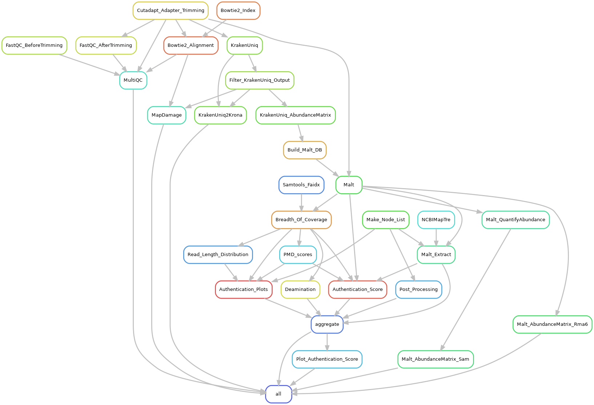

# aMeta: an accurate and memory-efficient ancient Metagenomic profiling workflow

## About

aMeta is a Snakemake workflow for identifying microbial sequences in
ancient DNA shotgun metagenomics samples. The workflow performs:

- trimming adapter sequences and removing reads shorter than 30 bp with Cutadapt
- quality control before and after trimming with FastQC and MultiQC
- taxonomic sequence kmer-based classification with KrakenUniq
- sequence alignment with Bowtie2 and screening for common microbial
  pathogens
- deamination pattern analysis with MapDamage2
- Lowest Common Ancestor (LCA) sequence alignment with Malt
- authentication and validation of identified microbial species with
  MaltExtract

You can get overview of aMeta from the rule-graph (DAG) below:

When using aMeta and / or pre-built databases provided together with
the wokflow for your research projects, please cite our article:

    Zoé Pochon*, Nora Bergfeldt*, Emrah Kırdök, Mário Vicente, Thijessen Naidoo,
    Tom van der Valk, N. Ezgi Altınışık, Maja Krzewińska, Love Dalen, Anders Götherström*,
    Claudio Mirabello*, Per Unneberg* and Nikolay Oskolkov*,
    aMeta: an accurate and memory-efficient ancient Metagenomic profiling workflow,
    Genome Biology 2023, 24 (242), https://doi.org/10.1186/s13059-023-03083-9

## Authors

* Nikolay Oskolkov (@LeandroRitter) nikolay.oskolkov@scilifelab.se
* Claudio Mirabello (@clami66) claudio.mirabello@scilifelab.se
* Per Unneberg (@percyfal) per.unneberg@scilifelab.se

## Installation

Clone the github repository, then create and activate aMeta conda
environment (here and below `cd aMeta` implies navigating to the
cloned root aMeta directory). For this purpose, we recommend
installing own `conda`, for example from here
https://docs.conda.io/en/latest/miniconda.html, and `mamba`
https://mamba.readthedocs.io/en/latest/installation.html:

    git clone https://github.com/NBISweden/aMeta
    cd aMeta
    # For conda version < 23.10 use mamba instead of conda
    conda env create -f workflow/envs/environment.yaml
    conda activate aMeta
    # For snakemake >= v8
    conda install snakemake-storage-plugin-http --channel conda-forge --channel bioconda

Run a test to make sure that the workflow was installed correctly:

    cd .test
    ./runtest.sh -j 1

Here, and below, by `-j` you can specify the number of threads that
the workflow can use. Please make sure that the installation and test
run accomplished successfully before proceeding with running aMeta on
your real data. Potential problems with installation and test run
often come from unstable internet connection and particular `conda`
settings used e.g. at computer clusters, therefore we advise you to
use your own freshly installed `conda`. Also, please note that the
test run currently needs ~16 GB of RAM which is suitable for running
on regular laptops. Nevertheless, when executing the test run on a
computer cluster one should pay attention to assigning more than one
core to the job since one core in a computer cluster may have less
then 16 GB (for example ~8 GB) of RAM, and this can be the reason for
failure of the test run on an HPC while it can still run fine on a
laptop.

## Quick start

To run the worflow you need to prepare a tab-delimited sample-file
`config/samples.tsv` with at least two columns, and a configuration
file `config/config.yaml`, below we provide examples for both files.

Here is an example of `samples.tsv`, this implies that the fastq-files
are located in `aMeta/data` folder:

    sample	fastq
    foo	data/foo.fq.gz
    bar	data/bar.fq.gz

Currently, it is important that the sample names in the first column
exactly match the names of the fastq-files in the second column. For
example, a fastq-file "data/foo.fq.gz" specified in the "fastq"
column, must have a name "foo" in the "sample" column. Please make
sure that the names in the first and second columns match.

Below is an example of `config.yaml`, here you will need to download a
few databases that we made public (or build databases yourself).

    samplesheet: "config/samples.tsv"

    # KrakenUniq Microbial NCBI NT database (if you are interested in prokaryotes only)
    # can be downloaded from https://doi.org/10.17044/scilifelab.20518251
    krakenuniq_db: resources/DBDIR_KrakenUniq_MicrobialNT

    # KrakenUniq full NCBI NT database (if you are interested in prokaryotes and eukaryotes)
    # can be downloaded from https://doi.org/10.17044/scilifelab.20205504
    #krakenuniq_db: resources/DBDIR_KrakenUniq_Full_NT

    # Bowtie2 index and helping files for following up microbial pathogens
    # can be downloaded from https://doi.org/10.17044/scilifelab.21185887
    bowtie2_db: resources/library.pathogen.fna
    bowtie2_seqid2taxid_db: resources/seqid2taxid.pathogen.map
    pathogenomesFound: resources/pathogensFound.very_inclusive.tab

    # Bowtie2 index for full NCBI NT (for quick followup of prokaryotes and eukaryotes),
    # can be downloaded from https://doi.org/10.17044/scilifelab.21070063 (please unzip files)
    # For using Bowtie2 NT index, replace "bowtie2_db" and "bowtie2_seqid2taxid_db" above by
    #bowtie2_db: resources/library.fna
    #bowtie2_seqid2taxid_db: resources/seqid2taxid.map.orig

    # Helping files for building Malt database
    # can be downloaded from https://doi.org/10.17044/scilifelab.21070063
    malt_nt_fasta: resources/library.fna
    malt_seqid2taxid_db: resources/seqid2taxid.map.orig
    malt_accession2taxid: resources/nucl_gb.accession2taxid

    # A path for downloading NCBI taxonomy files (performed automatically)
    # you do not need to change this line
    ncbi_db: resources/ncbi

    # Breadth and depth of coverage filters
    # default thresholds are very conservative, can be tuned by users
    n_unique_kmers: 1000
    n_tax_reads: 200

There are several ways to download the database files. One option is
to follow this link https://docs.figshare.com/#articles_search and
search for the last number in the database links provided above in the
"article_id" search bar. This will give you the download url for each
file. Then you can either use wget inside a screen session or tmux
session to download it, or aria2c, for example,
https://aria2.github.io/. N.B. We strongly recommend you not to mix
the databases in the same directory but place them in individual
folders, otherwise they may overwrite each other. Also, if you use the
KrakenUniq full NCBI NT database and / or Bowtie2 index of full NCBI
NT, please keep in mind, that the reference genomes used for building
the database / index were imported as is from the BLASTN tool
https://blast.ncbi.nlm.nih.gov/Blast.cgi. This implies that the
majority of eukaryotic reference genomes (including human reference
genome) included in the database / index may be of poor quality for
the sake of minimization of resource usage. In contrast, the vast
majority of microbial reference genomes included in the NCBI NT
database / index are of very good (complete) quality. Therefore, if
the goal of your analysis is human / animal microbiome profiling, we
recommend you to use the Microbial NCBI NT database / index, this will
make sure that human / animal reads will not be acidentally assiged to
microbial organisms. However, the full NCBI NT database / index are
very useful if you work with e.g. sedimentary or environmental ancient
DNA, and your goal is to simply detect in unbiased way all prokaryotic
and eukaryotic organisms present in your samples, without trying to
precisely quantify their abundance.

After you have prepared the sample- and configration-file, please
install job-specific environments, update Krona taxonomy and modify
default java heap space parameters for Malt jobs:

    cd aMeta
    # install job-specific environments
    snakemake --snakefile workflow/Snakefile --use-conda --conda-create-envs-only -j 20

    # update Krona taxonomy
    env=$(grep krona .snakemake/conda/*yaml | awk '{print $1}' | sed -e "s/.yaml://g" | head -1)
    cd $env/opt/krona/
    ./updateTaxonomy.sh taxonomy
    cd -

    # modify default java heap space parameters for Malt jobs
    env=$(grep hops .snakemake/conda/*yaml | awk '{print $1}' | sed -e "s/.yaml://g" | head -1)
    conda activate $env
    version=$(conda list malt --json | grep version | sed -e "s/\"//g" | awk '{print $2}')
    cd $env/opt/malt-$version
    sed -i -e "s/-Xmx64G/-Xmx512G/" malt-build.vmoptions
    sed -i -e "s/-Xmx64G/-Xmx512G/" malt-run.vmoptions
    cd -
    conda deactivate

Finally, the workflow can be run using the following command line:

    cd aMeta
    snakemake --snakefile workflow/Snakefile --use-conda -j 20

In the sections **More configuration options**, **Environment module
configuration** and **Runtime configuration** we will give more
information about fine-tuning the configuration as well as
instructions on how to run the workflow in a computer cluster
enviroment.

More details about running aMeta can be found in the step-by-step
tutorial available in the `aMeta/vignettes` directory.

## Main results of the workflow and their interpretation

All output files of the workflow are located in `aMeta/results`
directory. To get a quick overview of ancient microbes present in your
samples you should check a heatmap in
`results/overview_heatmap_scores.pdf`.

The heatmap demonstrates microbial species (in rows) authenticated for
each sample (in columns). The colors and the numbers in the heatmap
represent authentications scores, i.e. numeric quantification of eight
quality metrics that provide information about microbial presence and
ancient status. The authentication scores can vary from 0 to 10, the
higher is the score the more likely that a microbe is present in a
sample and is ancient. Typically, scores from 8 to 10 (red color in
the heatmap) provide good confidence of ancient microbial presence in
a sample. Scores from 5 to 7 (yellow and orange colors in the heatmap)
can imply that either: a) a microbe is present but not ancient, i.e.
modern contaminant, or b) a microbe is ancient (the reads are damaged)
but was perhaps aligned to a wrong reference, i.e. it is not the
microbe you think about. The former is a more common case scenario.
The latter often happens when an ancient microbe is correctly detected
on a genus level but we are not confident about the exact species, and
might be aligning the damaged reads to a non-optimal reference which
leads to a lot of mismatches or poor evennes of coverage. Scores from
0 to 4 (blue color in the heatmap) typically mean that we have very
little statistical evedence (very few reads) to claim presence of a
microbe in a sample.

To visually examine the eight quality metrics

1. deamination profile,
2. evenness of coverage,
3. edit distance (amount of mismatches) for all reads,
4. edit distance (amount of mismatches) for damaged reads,
5. read length distribution,
6. PMD scores distribution,
7. number of assigned reads (depth of coverage),
8. average nucleotide identity (ANI)

corresponding to the numbers and colors of the heatmap, one can find
them in
`results/AUTHENTICATION/sampleID/taxID/authentic_Sample_sampleID.trimmed.rma6_TaxID_taxID.pdf`
for each sample `sampleID` and each authenticated microbe `taxID`. An
example of such quality metrics is shown below:

In case you are interested in an overview of microbial species present
in your samples **irrespective of their ancient status**, you can
simply check a KrakenUniq abundance matrix here
`results/KRAKENUNIQ_ABUNDANCE_MATRIX/krakenuniq_absolute_abundance_heatmap.pdf`:

The values in the heatmap above indicate the numbers of reads assigned
to each microbe in each species. The corresponding Total Sum Scaled
(TSS), aka library size normalized, KrakenUniq abundance matrix is
located in
`results/KRAKENUNIQ_ABUNDANCE_MATRIX/krakenuniq_normalized_abundance_heatmap.pdf`.
Please note that the microbial species in the KrakenUniq abundance
matrix might not always overlap with the ones present in the
authentication score heatmap above. This is because not all microbes
detected by KrakenUniq at the pre-screening step can be successfully
validated by Malt + MaltExtract. The absolute and normalized microbial
abundance heatmaps are optimal for visual exploration for up to
~50-100 samples and ~100-200 species. For larger numbers of samples
and / or species, the heatmaps may become too crowded and difficult to
view; therefore, in this case, the users are advised to utilize the
raw KrakenUniq abundance matrix `krakenuniq_abundance_matrix.txt` for
their own custom visualization.

Finally, below we list locations and provide short comments for a few
other useful metrics / plots / information delivered by aMeta which
you perhaps would also like to check:

- the deamination profile computed by MaltExtract among the eight
validation and authentication metrics above might be less informative
than the one delivered by MapDamage. You can find the deamination
profile for the microbe of interest with `taxID` detected in sample
`sampleID` here
`results/MAPDAMAGE/sampleID/taxID.tax.bam/Fragmisincorporation_plot.pdf`.
Please note that the MapDamage deamination profile is computed on
Bowtie2 alignments without LCA, these alignments might be less
accurate than the LCA-based Malt alignments used for MaltExtract.

- visualization of KrakenUniq microbial detection results for each sample `sampleID` is available at `results/KRAKENUNIQ/sampleID/taxonomy.krona.html`.

- unfiltered KrakenUniq results for each sample `sampleID` can be found in `results/KRAKENUNIQ/sampleID/krakenuniq.output`, filtered with `n_unique_kmers` (breadth of coverage) and `n_tax_reads` (depth of coverage) can be found in `results/KRAKENUNIQ/sampleID/krakenuniq.output.filtered`, and the pathogenic subset of the filtered KrakenUniq results for each sample `sampleID` is available in `results/KRAKENUNIQ/sampleID/krakenuniq.output.pathogens`.
- Malt microbial abundance matrix quantified from rma6- and sam-files can be found in `results/MALT_ABUNDANCE_MATRIX_RMA6/malt_abundance_matrix_rma6.txt` and `results/MALT_ABUNDANCE_MATRIX_SAM/malt_abundance_matrix_sam.txt`, respectively. These abundance matrices are complementary and can be compared with the KrakenUniq abundance matrix from `results/KRAKENUNIQ_ABUNDANCE_MATRIX/krakenuniq_abundance_matrix.txt` for a better intuition about microbial presence and abundance.
- all technical details on the quality of your data, adapter trimming, alignments etc. can be found in `results/MULTIQC/multiqc_report.html`.

## More configuration options

Within `config.yaml` one can specify what samples to analyse in the
`samples` section through the `include` and `exclude` keys, so that a
global samplesheet can be reused multiple times.

Analyses `mapdamage`, `authentication`, `malt`, and `krona` can be
individually turned on and off in the `analyses` section.

Adapter sequences can be defined in the `adapters` section of
`config.yaml`. The keys `config['adapters']['illumina']` (default
`true`) and `config['adapters']['nextera']` (default `false`) are
switches that turn on/off adapter trimming of illumina
(`AGATCGGAAGAG`) and nextera (`AGATCGGAAGAG`) adapter sequences.
Addional custom adapter sequences can be set in the configuration key
`config['adapters']['custom']` which must be an array of strings.

An example snippet that can optionally be added to the configuration file `config.yaml` is shown below:

    # you can include or exclude samples
    samples:
      include:
        - foo
      exclude:
        - bar

    # you can include or exclude certain types of analysis
    analyses:
      mapdamage: true
      authentication: true
      malt: true
      krona: true

    # you can specify type of adapters to trim
    adapters:
      illumina: true
      nextera: false
      # custom is a list of adapter sequences
      custom: []

## Environment module configuration

To run the workflow in a computer cluster environemnt you should
specify environmental modules and runtimes via `--profile` as follows:

    snakemake --snakefile workflow/Snakefile -j 100 --profile .profile --use-envmodules

If the workflow is run on a HPC with the `--use-envmodules` option
(see
[using-environment-modules](https://snakemake.readthedocs.io/en/stable/snakefiles/deployment.html#using-environment-modules)),
the workflow will check for an additional file that configures
environment modules. By default, the file is `config/envmodules.yaml`,
but a custom location can be set with the environment variable
`ANCIENT_MICROBIOME_ENVMODULES`.

Environmental modules configurations are placed in a configuration
section `envmodules` with key-value pairs that map a dependency set to
a list of environment modules. The dependency sets are named after the
rule's corresponding conda environment file, such that a dependency
set may affect multiple rules. For instance, the following example
shows how to define modules for rules depending on fastqc, as it would
be implemented on the [uppmax](https://uppmax.uu.se/) compute cluster:

    envmodules:
      fastqc:
        - bioinfo-tools
        - FastQC

See the configuration schema file
(`workflows/schema/config.schema.yaml`) for more information.

## Runtime configuration

Most individual rules define the number of threads to run. Although
the number of threads for a given rule can be tweaked on the command
line via the option `--set-threads`, it is advisable to put all
runtime configurations in a
[profile](https://snakemake.readthedocs.io/en/stable/snakefiles/best_practices.html).
At its simplest, a profile is a directory (e.g. `.profile` in the
working directory) containing a file `config.yaml` which consists of
command line option settings. In addition to customizing threads, it
enables the customization of resources, such as runtime and memory. An
example is shown here:

    # Rerun incomplete jobs
    rerun-incomplete: true
    # Restart jobs once on failure
    restart-times: 1
    # Set threads for mapping and fastqc
    set-threads:
      - Bowtie2_Alignment=10
      - FastQC_BeforeTrimming=5
    # Set resources (runtime in minutes, memory in mb) for malt
    set-resources:
      - FastQC_BeforeTrimming:mem_mb=1000
      - FastQC_AfterTrimming:mem_mb=1000
      - Malt:runtime=7200
      - Malt:mem_mb=512000
    # Set defalt resources that apply to all rules
    default-resources:
      - runtime=120
      - mem_mb=16000
      - disk_mb=1000000

For more advanced profiles for different hpc systems, see
[Snakemake-Profiles github
page](https://github.com/snakemake-profiles).

## Nox tests

In addition to the regular tests, there is also the option to run
tests based on the [nox](https://nox.thea.codes) framework. These
tests are mainly aimed at developers.

### Requirements

To run nox tests you need to install a number of requirements. See the
[nox homepage](https://nox.thea.codes) for details; a short summary
follows here.

Install nox, either with [pipx](https://pipx.pypa.io/stable/)

    pipx install nox

or [pip](https://pip.pypa.io/en/stable/)

    python3 -m pip install nox

### Nox sessions

The test file `.test/noxfile.py` defines parametrized test sessions
that you can list with

    nox --list

nox will test different combinations of Python and Snakemake and run
[pytest](https://docs.pytest.org/en/8.2.x/) tests in isolated test
directories. You can [specify parametrized
sessions](https://nox.thea.codes/en/stable/usage.html#specifying-parametrized-sessions)
by passing the session name:

    nox --session "snakemake(python='3.11', snakemake='7.32.4')"

To reuse nox sessions and avoid reinstallation of dependencies, use
the `-R` option.

## Frequently Asked Questions (FAQ)

### My fastq-files do not contain adapters, how can I skip the adapter removal step?

To our experinece, there are very often adapter traces left even after
an adapter removing software has been applied to the fastq-files.
Therefore, we strongly recommend not to skip the adapter removal step.
This step is typically not time consuming and can only be beneficial
for the analysis. Otherwise, adapter contamination can lead to severe
biases in microbial discovery.

### I have paired-end (PE) sequencing data, does aMeta support it?

Currently not, but this option will be added soon. As in other aDNA
analyses, PE reads need to be merged prior to using aMeta, this can be
achieve by e.g. `fastp` https://github.com/OpenGene/fastp.
Alternatively, simple concatenation of R1 and R2 reads as

    cat R1.fastq.gz R2.fastq.gz > merged.fastq.gz

is also possible, and the resulting file `merged.fastq.gz` can be used
as input for aMeta.

### I get "Java heap space error" on the Malt step, what should I do?

Although you have already changed the default Malt max memory limit
from 64 GB to 512 GB in the Quick start section, you seem to need to
further increase it, which may indeed be needed for very large and
rich datasets. To increase it again please modify the
`malt-build.vmoptions` and `malt-run.vmoptions` files. To locate these
files you have to find the conda environment corresponding to Malt,
activate it and replace the current 512 GB with the amount of RAM
available on you computer node, in the example below it is 1024 GB:

    cd aMeta
    env=$(grep hops .snakemake/conda/*yaml | awk '{print $1}' | sed -e "s/.yaml://g" | head -1)
    conda activate $env
    version=$(conda list malt --json | grep version | sed -e "s/\"//g" | awk '{print $2}')
    cd $env/opt/malt-$version
    sed -i -e "s/-Xmx512G/-Xmx1024G/" malt-build.vmoptions
    sed -i -e "s/-Xmx512G/-Xmx1024G/" malt-run.vmoptions
    cd -
    conda deactivate

Nevertheless, if you keep getting the Java heap space error despite
you modified the vmoptions files, this might indicate that your memory
resource allocation is still not enough. In this case reserving a
compute node with larger amount of RAM may solve the problem.

### I get "Java heap space error" on the FastQC step, what should I do?

aMeta now depends on FastQC version >=0.12.1 which provides support
for setting the memory at runtime. The FastQC rules have been updated
such that you now can set the memory requirements with the
`--set-resources` flag e.g.

    --set-resources FastQC_BeforeTrimming:mem_mb=1000
    --set-resources FastQC_AfterTrimming:mem_mb=1000

or in a Snakemake profile configuration (see section `Runtime configuration` above).

### MatExtract takes a lot of time and looks frozen.

You are probably running aMeta (or at least some jobs from aMeta) on
nodes without internet connection. If this is the case, you have to
manually download and provide NCBI taxonomy for MaltExtract, i.e.
`ncbi.map` and `ncbi.tre` files, from here
`https://github.com/husonlab/megan-ce/tree/master/src/megan/resources/files`
and place them to `resources/ncbi`.

### I get a "No validator found" message, should I be worried?

Short answer: no, you do not need to be worried about purple snakemake warning text. Only red messages indicate an error and should be investigated.

### aMeta takes a lot of time to run, can I speed it up?

If you run aMeta using our pre-built database:

    KrakenUniq DB on full NCBI NT: https://doi.org/10.17044/scilifelab.20205504
    KrakenUniq DB on microbial part of NCBI NT: https://doi.org/10.17044/scilifelab.20518251
    KrakenUniq DB on microbial part of NCBI RefSeq: https://doi.org/10.17044/scilifelab.21299541
    Bowtie2 index for full NCBI NT database: https://doi.org/10.17044/scilifelab.21070063
    Bowtie2 index on pathogenic microbes of NCBI NT: https://doi.org/10.17044/scilifelab.21185887

it can be very fast (a few hours for a sample with ~10 mln reads) if
you have enough RAM (recommended minimum ~200 GB, ideally ~1 TB).
Otherwise, runing aMeta with smaller RAM is also possible but results
in much longer computation times. We prioritize using large databases
for more accurate metagenomic analysis. Alternatively, smaller
databases can also be used which might speed up aMeta considerably,
but very likely result in less accurate analysis (lower sensitivity
and specificity).

### What should I do in case aMeta has stopped prematurely?

Snakamake framework of aMeta may sometimes be too sensitive to small
warning messages even if many of them are safe to ignore. This can
result in a premature stop of aMeta. Sometimes it helps to simply
restart aMeta from the failed part of the analysis, for example
AUTHENTICATION, from scratch by deleting the whole folder
`Meta/results/AUTHENTICATION`. If you wish to restart aMeta from the
moment where it stopped, you may want to consider using
`--rerun-incomplete` (to recompute likely corrupted files due to
premature stop) and `--unlock` (to resume running the jobs in case you
manually interrrupted snakemake) flags appended to the main snakemake
command line from the Quick start section. If you are sure that the
reason for premature stop of aMeta can safely be ignored, you may want
to apply `--keep-going` to continue running aMeta.
